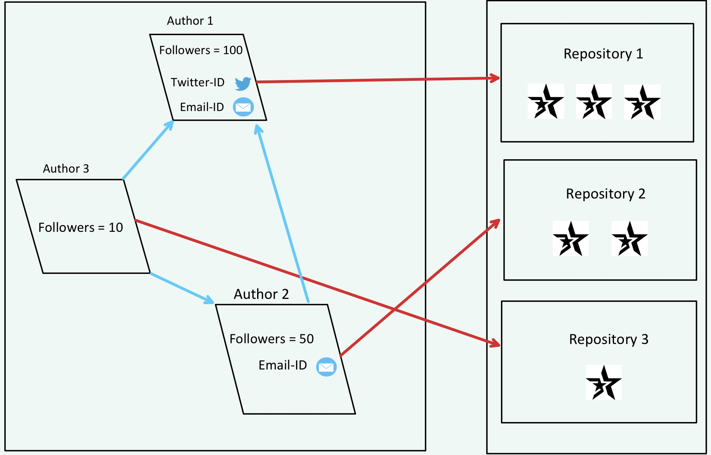
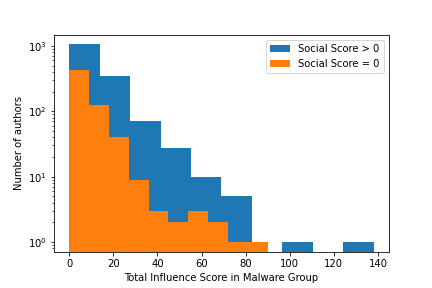
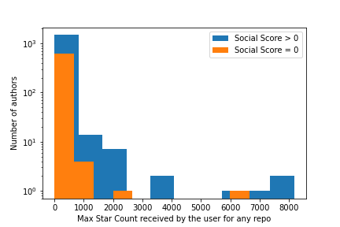
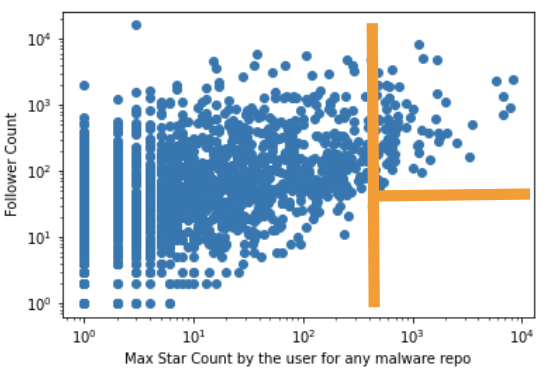
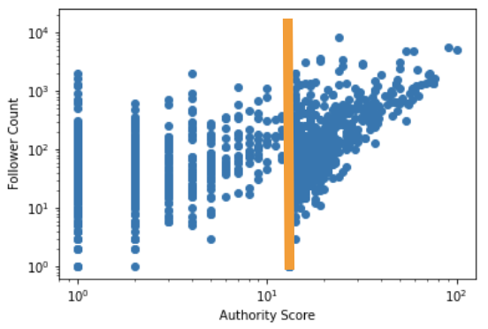
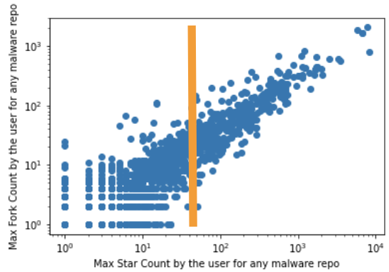
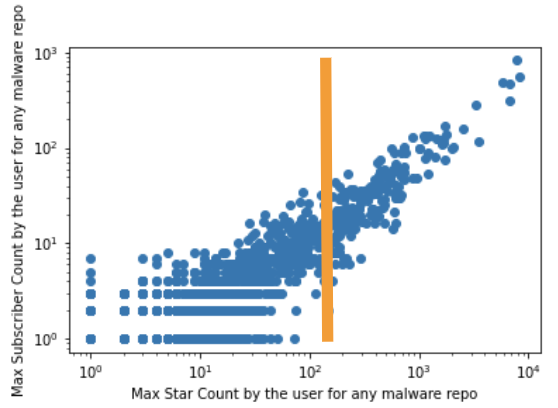

# Diving into Popularity of GitHub Repositories

# Key Idea of the project

What are the features that can best define the popularity of GitHub repositories? Since GitHub is being widely used as the most popular open source platform, thorough investigation of the correlation of different features of a repository will greatly benefit the research communities to predict the evolution of popular repositories. The challenging factor is to identify the driving features based on which a repository can be tagged as popular. This study represents an exploratory data analysis on a set of 7.5k malware repositories to view the popularity from various angles. We analyze both author-centric and repository- centric features, and find strong correlation between them. We notice that authors often provide contact information in their profile. Most of these authors have handsome amount of followers, and are influential in their network as well. The repositories they publish receive greater interactions from the community being rewarded more stars. Our analysis suggests that author-centric features alone can better approximate repository- centric features. As a result, instead of manipulating all of the features, author-centric information should be exploited properly to predict the popularity of GitHub repositories. We use python programming language and its several packages for crawling data related to authors and repositories, and data analysis. The project consists of around 600 lines of code.

  

# Dataset

Dataset. We do our experimentation on a dataset of 7.5k malware GitHub repositories. To understand the influence of GitHub authors in the community, we discard the authors who have no followers. We extract 5045 malware authors who have at least one follower accordingly. Furthermore, we attempt to find whether these malware authors are following each other because of the similarity of their contents, and we locate a group of 2123 authors. Among the group, every author is followed by at least one other author from the same group. To perform our analysis, we crawl repository and author centric features for each of the malware repositories the group members have.

# Experimentation
We create an Author-Author directed network graph, G(V,E) to understand the network-wide influence of the malware authors, where V is set of vertices corresponding to each of the member authors detected in the group, and E is the set of edges. Each (u,v) edge denotes that author v is followed by author u. Then we apply HITS algorithm [8] on the constructed author-author graph to measure the influence of the authors in the network. The influence is calculated in two parts, (a) authority score and (b) hub score.
From the contact information available in the author profile, we also calculate social score for each of the authors in the group. We consider email id, twitter handle and blog url as the contact information for social score calculation. These scores have been defined as follows:
1) authority score: is the measurement for an author t0 be followed by the other influential author in the network. The more score an author has, the more he/she is influ- ential.
2) hub score: is the measurement for an author to follow other influential author in the network. The more score an author has, the more he/she follows other influential authors in the network. Table 1 shows the statistics of contact information provided by the group of malware authors that we consider.
3) social score: is determined by how many ways an author can be communicated using the contact information pro- vided in the GitHub account. If an author shares email id, twitter handle and blog url, the score will be 3.

  

# Result of the analysis

  
  

  
  

  
  

